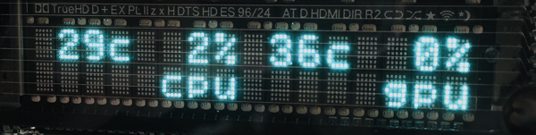

# afterburner-lcd

Reads data monitored by MSI Afterburner from shared memory and displays it on a Matrix Orbital LK series compatible LCD/VFD.

## Usage

### Driver Installation (for USB connected LCD/VFD)

Communication with the LCD/VFD is done via a serial port (COM port).
Therefore, if you are using a USB-connected LCD/VFD, a conversion is necessary.

Most USB-connected LCD/VFDs commonly found on AliExpress use the CH340 chip. By installing the following driver, you can connect via a serial port.
[CH340/CH341 driver for Windows](https://www.wch-ic.com/products/CH340.html)

### MSI Afterburner Installation and Configuration

Install [MSI Afterburner](https://www.msi.com/Landing/afterburner/graphics-cards) and, in the Monitoring tab within settings, check the parameters you need. Items not enabled here will not be written to shared memory and cannot be read.

### Configuration

Edit the `.env` file according to your environment.

```ini:.env
# LCD Settings
COM_PORT=COM4
BAUD_RATE=9600
LCD_WIDTH=16
LCD_HEIGHT=2

# Application Settings
UPDATE_INTERVAL=1000
RETRY_INTERVAL=30000
```

- `COM_PORT` : The serial port to use. You can check this in Device Manager. If you installed the CH340 driver, it might appear as USB-SERIAL CH340 (COM4) in Device Manager.
- `LCD_WIDTH`: Number of characters per line.
- `LCD_HEIGHT`: Number of lines.
- `UPDATE_INTERVAL`: Screen update frequency in milliseconds.
- `RETRY_INTERVAL`: If connection or data retrieval fails, it will retry after this time in milliseconds.

```ini:.env
# Format Strings (sprintf-js format + {variableName})
# Add LINE_FORMAT_3, LINE_FORMAT_4 ... as needed
LINE_FORMAT_1="%3d{cpuTemperature}c%3d{cpuUsage}%%3d{gpuTemperature}c%3d{gpuUsage}%"
LINE_FORMAT_2="     cpu     gpu"
```
- `LINE_FORMAT_N`: Defines the display format. Add lines corresponding to the number of display lines.

`variableName` is the camel-cased version of the parameter name before localization in MSI Afterburner's settings (e.g., GPU Temperature -> gpuTemperature). You can refer to the list of currently acquired parameters displayed in the console by selecting "Show Data" from the taskbar icon.

With this configuration, it will be displayed like this:


### Launch

The console window will automatically hide 5 seconds after launch. You can perform actions such as Stop/Resume, Show/Hide Window, Show Parameters List, and Exit from the taskbar icon.

## References

- [# My first encounter with VFD!](https://www.youtube.com/watch?v=g7SOxzKatCc) - Explains how to investigate VFD specifications by sniffing the serial port.

## Disclaimer

Basically for personal use, so not extensively tested.
Let me know if anything seems wrong.
